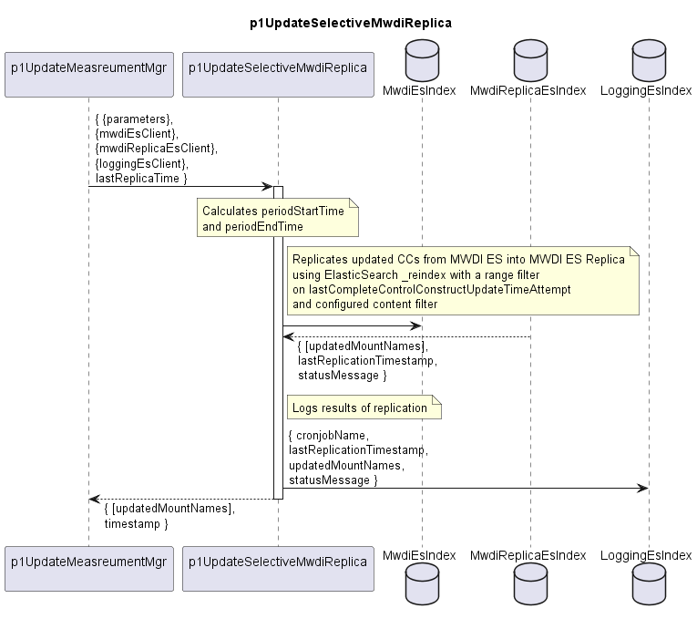

# p1UpdateSelectiveMwdiReplica

The p1UpdateSelectiveMwdiReplica function performs an incremental selective replication of the MWDI ElasticSearch index into the MWDI ES Replica.  

A new value of the lastCompleteControlConstructUpdateTimeAttempt attribute at a ControlConstruct in the MWDI ES index triggers the
the same ControlConstruct, according to the configured replication scope, being replicated into the MWDI ES Replica.  

The consuming application may not require the complete set of ControlConstruct data, but only a specific subset. To optimize replication, the function supports a configurable replication scope based on top-level attributes and (sub-)classes. Only the configured attributes and classes are replicated, ensuring that the consuming application receives exactly the data it needs.

## Overview

After getting called, the p1UpdateSelectiveMwdiReplica ...  

- Determines the replication time period
  - periodStartTime = lastReplicaTime - overlapMs
    (The overlap ensures that no updates at the period boundary are missed)
  - periodEndTime = current time

- Copies all ControlConstructs (limited to relevant data) that changed during this period
  - Uses the ElasticSearch _reindex API with
    - a range filter on periodStartTime < lastCompleteControlConstructUpdateTimeAttempt <= periodEndTime
    - and a content filter from _source includes
  - Source index: sourceIndex
  - Destination index: destinationIndex
  - Existing documents in the Replica are overwritten with the latest version

- Updates the replication log in the LoggingEs with
  - periodStartTime
  - periodEndTime
  - number of replicated ControlConstructs
  - status message

- returns the list of MountNames of the updated ControlConstructs to the caller

## Diagram

<p align="center">
  
</p>

## Variables

Detailed description of the [internal variables](./variables.yaml).  

## Interface

Detailed description of the [interface](./interface.yaml).  

## Parameters

| Parameter Name               | Description                                                                                        |
|------------------------------|----------------------------------------------------------------------------------------------------|
| jobName                      | Name of the replication job                                                                        |
| syncPeriod                   | Duration between two replications of the MWDI ES in seconds                                        |
| lastUpdatedField             |                                                                                                    |
| overlapMs                    | Overlap in milliseconds to avoid missing updates at period boundaries                              |
| reqPerSec                    | NThrottles re-indexing to number of copy operations per second, preventing high load on the server |
| scrollSize                   | Number of documents returned per page when Elasticsearch performs a scroll search                  |
| scrollTtl                    | How long (time limit) Elasticsearch keeps the scroll context alive for each scroll window          |

## Sample query

```
POST _reindex?refresh=true
{
  "source": {
    "index": "mwdi",
    "size": 200,
    "_source": {
      "includes": [
        "last-complete-control-construct-update-time",
        "mountName",
        "mount-name",
        "core-model-1-4:control-construct.uuid",
        "core-model-1-4:control-construct.name",
        "core-model-1-4:control-construct.extension",
        "core-model-1-4:control-construct.top-level-equipment",
        "core-model-1-4:control-construct.equipment",
        "core-model-1-4:control-construct.firmware-1-0:firmware-collection"
      ]
    },
    "query": {
      "bool": {
        "must": [
          {
            "exists": {
              "field": "core-model-1-4:control-construct"
            }
          },
          {
            "range": {
              "last-complete-control-construct-update-time": {
                "gt": "2026-06-09T10:00:00.000Z",
                "lte": "now"
              }
            }
          }
        ]
      }
    }
  },
  "dest": {
    "index": "mwdi-firmware-replica",
    "op_type": "index"
  },
  "conflicts": "proceed"
}
```

## Data Filtering

Only data relevant to the application using the function shall be replicated.  
For this purpose a configurable list of desired attributes and classes can be provided by using a dedicated profileInstance.  
The content of this profileInstance is used as input for *_source.includes* in the below sample query.

> [!IMPORTANT]
> This works well for complete fields/subtrees, but not for filtering inside nested arrays (e.g. if only selected equipment entries or selected firmware components would be relevant). This is relevant especially in cases where data from logicalTerminationPoints is needed, as these are organized stored within an array - the whole LTP containing the majority of CC data needs to be copied.  

### Filter attributes

#### Required meta attributes
The following attributes are not part of the ControlConstruct data, but are to be included in *_source.includes*:
- `last-complete-control-construct-update-time`
- `mountName`
- `mount-name`

#### Top-level ControlConstruct attributes and classes

Below top-level elements of the *core-model-1-4:control-construct* are listed.

- **Attributes (leafs):**  
  - `core-model-1-4:control-construct.uuid`
  - `core-model-1-4:control-construct.lifecycle-state`
  - `core-model-1-4:control-construct.operational-state`
  - `core-model-1-4:control-construct.administrative-control`
- **Arrays:** (no filtering on the contained array elements supported)
  - `core-model-1-4:control-construct.logical-termination-point`
  - `core-model-1-4:control-construct.forwarding-domain`
  - `core-model-1-4:control-construct.top-level-equipment`
  - `core-model-1-4:control-construct.extension`
  - `core-model-1-4:control-construct.equipment`
- **Objects:** (these allow for accessing contained attributes and subclasses directly)
  - `core-model-1-4:control-construct.backup-and-restore-1-0:backup-and-restore-pac`
  - `core-model-1-4:control-construct.profile-collection`
  - `core-model-1-4:control-construct.firmware-collection`
  - `core-model-1-4:control-construct.administrative-state`
  - `core-model-1-4:control-construct.synchronization-1-0:ne-sync-pac`
  - `core-model-1-4:control-construct.synchronization-1-0:clock-collection`
  - `core-model-1-4:control-construct.equipment-augment-1-0:control-construct-pac`
  - `core-model-1-4:control-construct.alarms-1-0:alarm-pac`

### Configuration via profileInstance

Same as with all functions, p1UpdateSelectiveMwdiReplica is configured via providing filter attributes within a related string profileInstance.  
- the stringProfile does not contain the option to provide an array of strings
- it only allows for enumerations, which are not applicable here
- therefore, the desired attributes and classes are to be provided as a concatenated string
  - delimiter is `;`
  - example: `last-complete-control-construct-update-time;mountName;mount-name;core-model-1-4:control-construct.uuid;core-model-1-4:control-construct.equipment-augment-1-0:control-construct-pac;core-model-1-4:control-construct.equipment;core-model-1-4:control-construct.firmware-collection`
  - the string value is to be converted into the format required by *_source.include* by the implementation
- if no filter profileInstance is configured or if the string value of an associated profileInstance is empty, the complete CC shall be replicated

## NPM Module

[mw-sdn-p1-update-selective-mwdi-replica](https://www.npmjs.com/package/mw-sdn-p1-update-selective-mwdi-replica)  