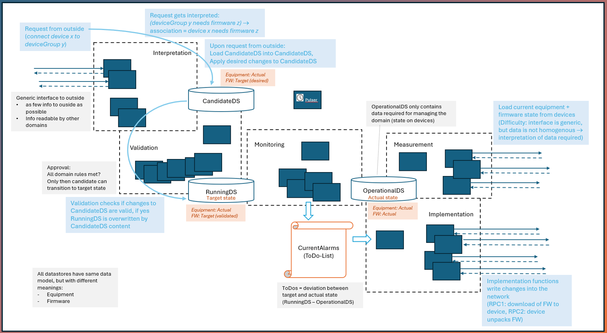
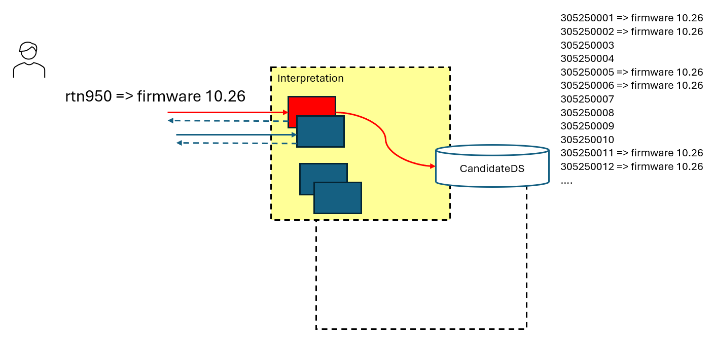
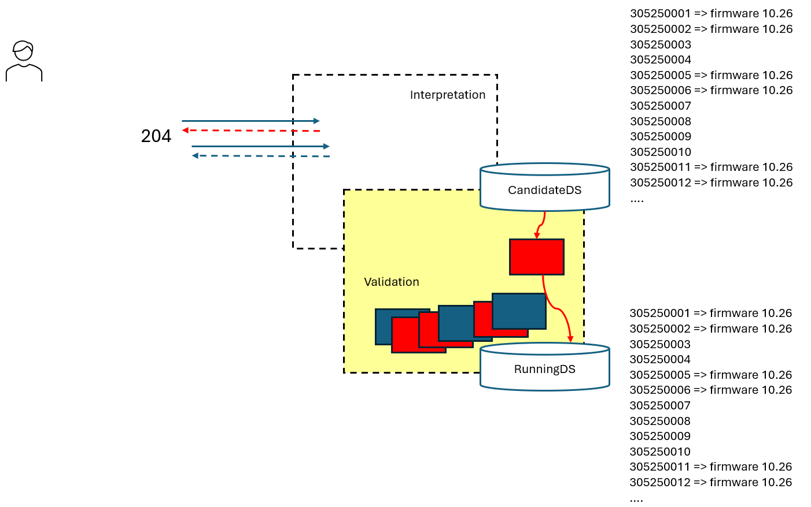
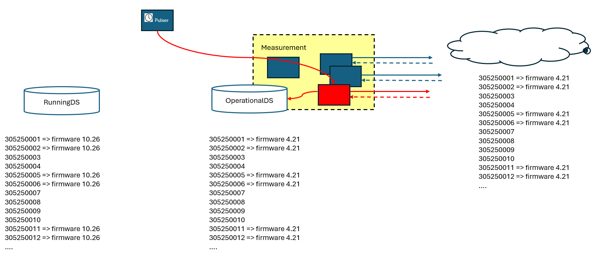
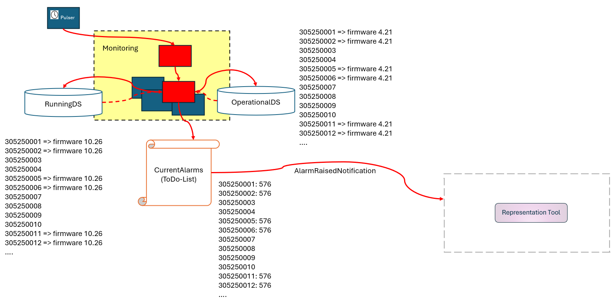
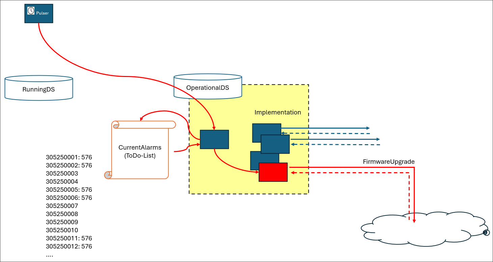
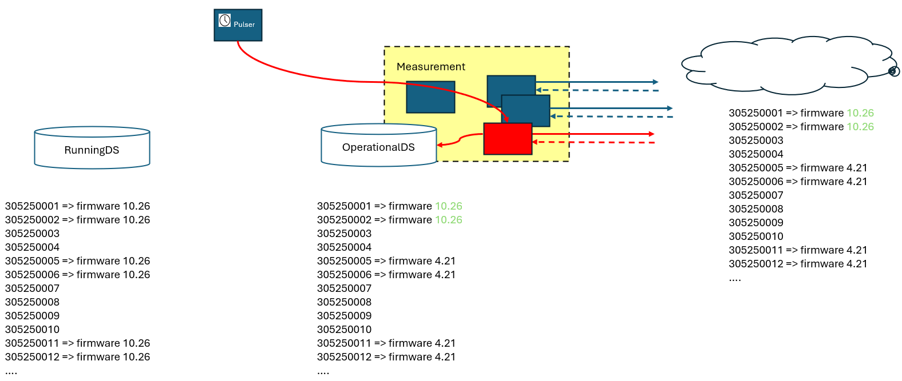
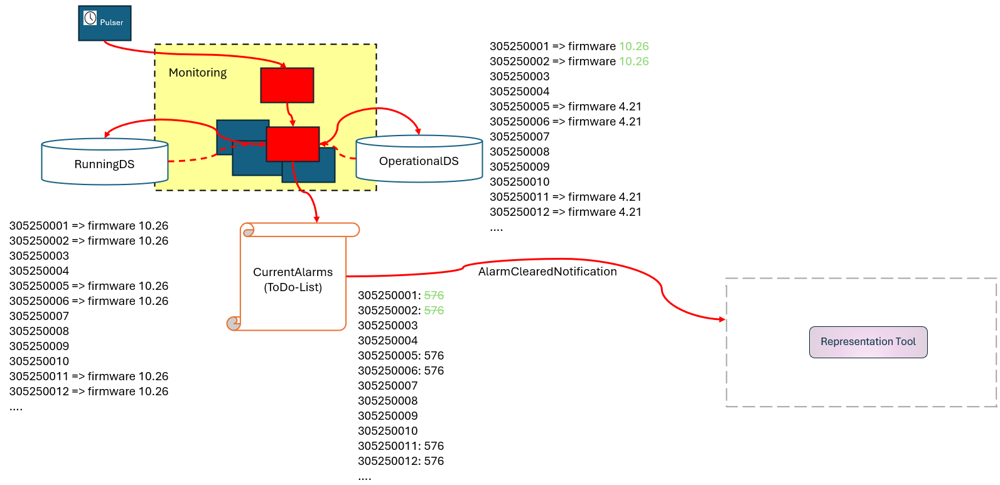

# AutomationArchitecture

## Application Design

  

  

## Example Use Case

_[to be created from 260623 Example FW update.pptx]_

A new firmware version shall be rolled out to all RTN950 devices.  
When the request is received, the content of the RunningDS is copied to the CandidateDS. At this point, the CandidateDS still contains firmware version 4.21 for all RTN950 devices. (This initial copy operation is not shown in the figure.)  
The request is then interpreted, and the firmware version of all RTN950 devices in the CandidateDS is updated to 10.26.

  

  

  

  

  

  

  

